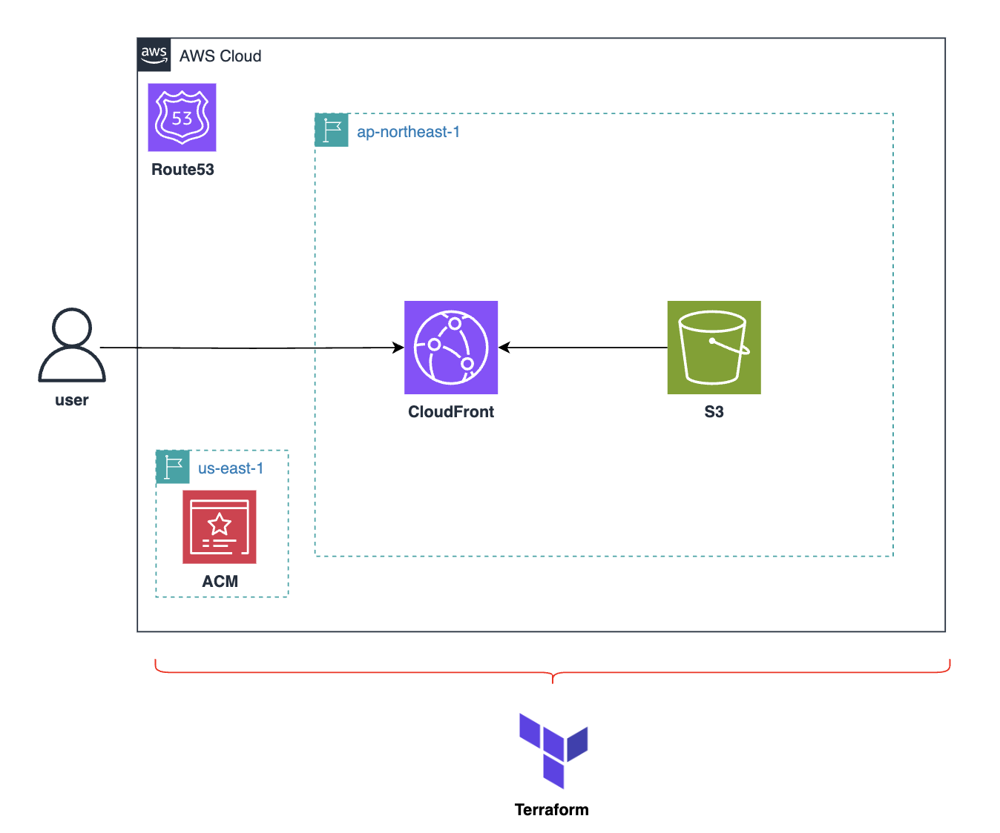

# terraform_s3_cloudfront
## 構成イメージ


**CloudShellを利用される方は、以下を実行してください。**

## Set up CloudShell
```sh
# Terraform v1.11.4 をダウンロード
wget https://releases.hashicorp.com/terraform/1.11.4/terraform_1.11.4_linux_amd64.zip

# 解凍して /usr/local/bin に配置
sudo unzip terraform_1.11.4_linux_amd64.zip -d /usr/local/bin/

# バージョン確認
terraform -version  # Terraform v1.11.4
```

## Shell Script Permissions
**実行権限を付与してからスクリプトを使ってください**

```sh
chmod +x ./script/deploy.sh
chmod +x ./script/destory.sh
```